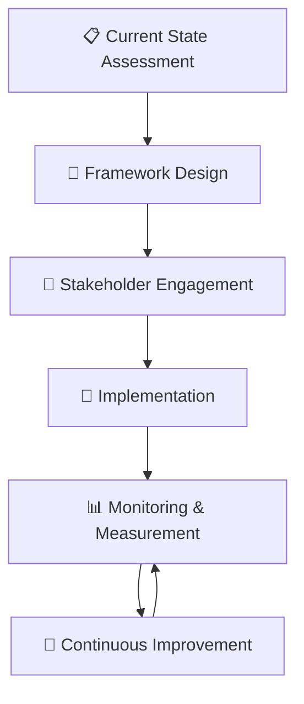
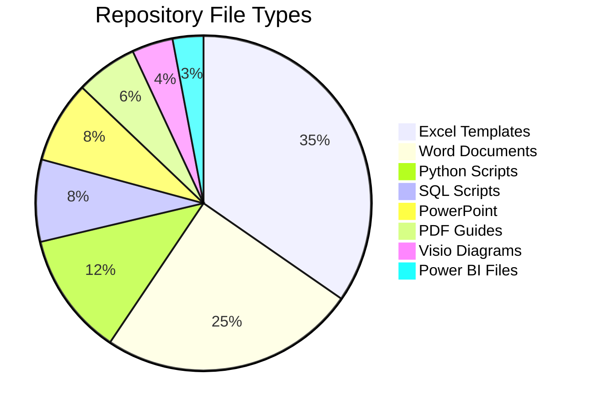
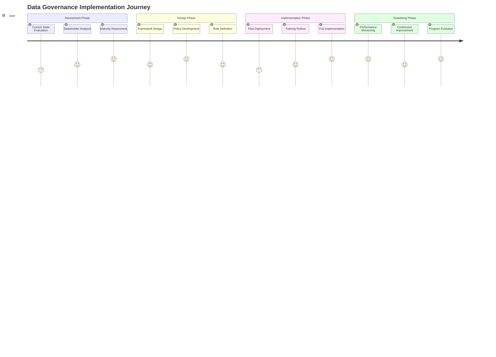
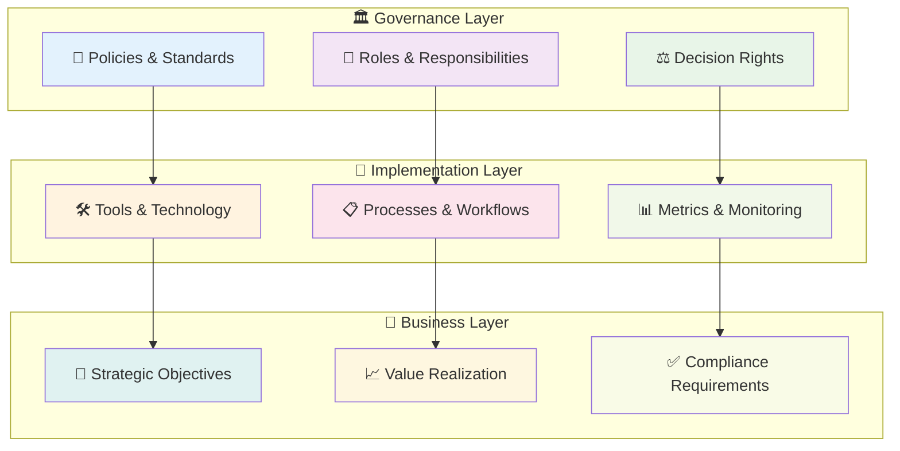
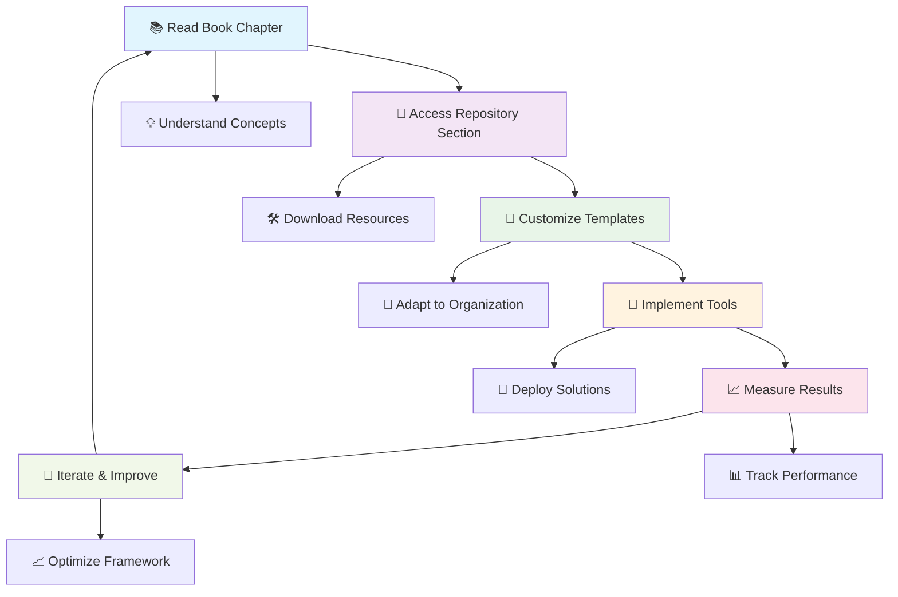
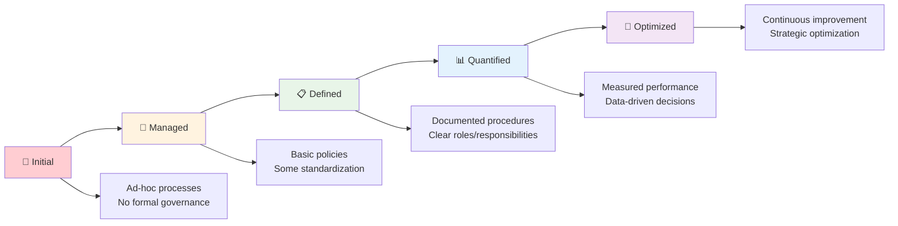
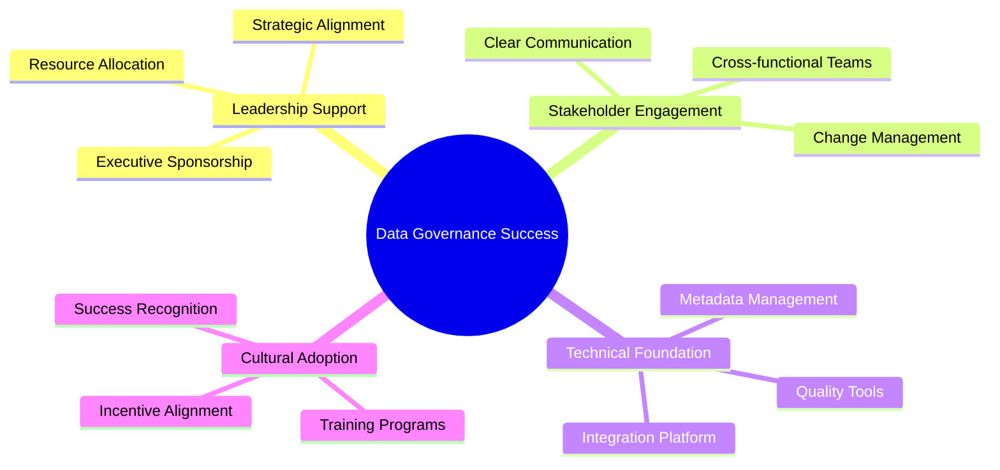
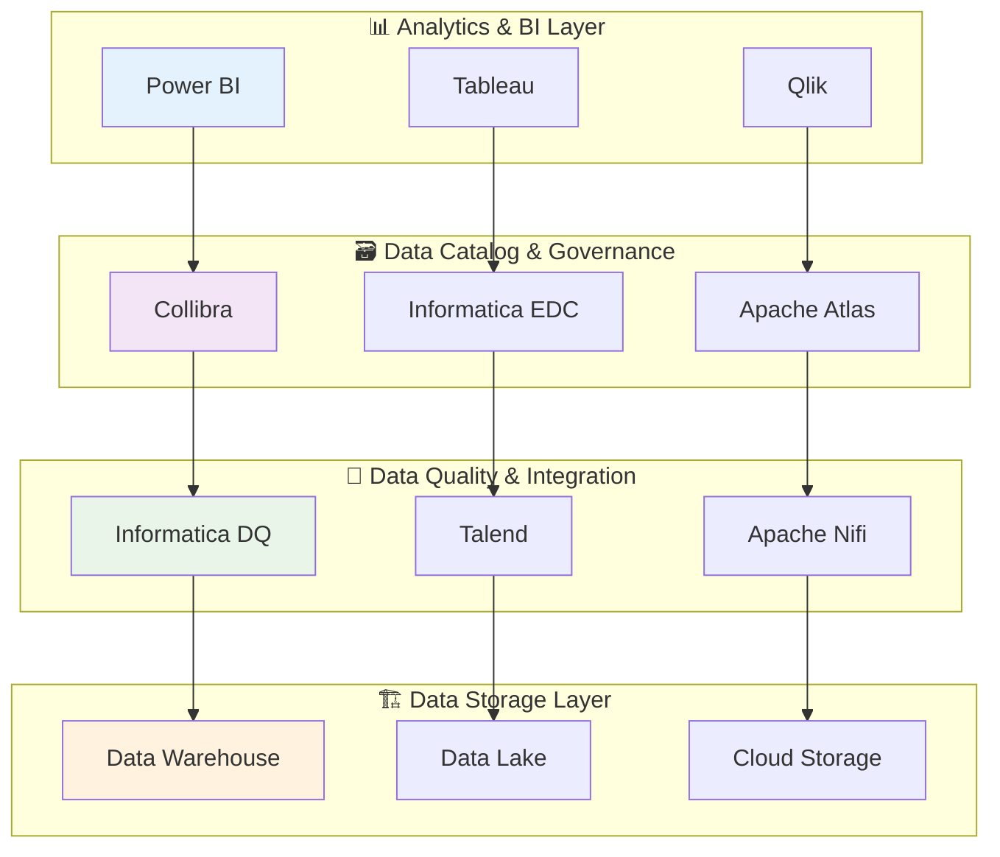

# 📊 Data Governance Framework Repository

[](https://github.com/JambaAcademy/Data_Governance)
[](https://opensource.org/licenses/MIT)
[](CONTRIBUTING.md)
[](https://www.amazon.com/dp/B0FPGF7S8R)
[](https://github.com/JambaAcademy/Data_Governance)

> **The official companion repository for "A Practical Guide to Mastering Data Governance"**  
> Transform your data chaos into strategic advantage with proven frameworks and implementation tools.

<div align="center">

</div>

## 🎯 **About This Repository**

In today's data-driven business landscape, organizations are drowning in information yet starving for actionable insights. This repository provides the complete implementation toolkit for establishing robust data governance that transforms raw data into strategic business assets.

This comprehensive collection contains **over $5,000 worth of professional-grade templates, tools, and frameworks**—available free with the book purchase. Whether you're launching your first governance initiative or refining existing programs, these resources serve as your complete tactical manual.

**📖 Get the Book:** [Available on Amazon](https://www.amazon.com/dp/B0FPGF7S8R)

---

## 🚀 **Quick Start Guide**

### Prerequisites
- Basic understanding of data management concepts
- Organizational readiness for governance initiatives
- Access to stakeholder groups and data systems

### Getting Started
1. **📋 Start with Assessment**: Use the `02_Assessment_Maturity_Tools` to evaluate your current state
2. **📝 Define Framework**: Customize templates from `01_Governance_Framework_Templates`
3. **🚀 Plan Implementation**: Follow roadmaps in `03_Implementation_Resources`
4. **📊 Measure Success**: Deploy dashboards from `09_Measurement_Reporting`



---

## 📂 **Repository Structure**

```
Data_Governance/
├── 01_Governance_Framework_Templates/
│   ├── Policy_Documents/
│   │   ├── 📜 Data_Governance_Charter_Template.docx
│   │   ├── 👥 Data_Stewardship_Policy.docx
│   │   ├── ✅ Data_Quality_Standards.docx
│   │   ├── 🗂️ Data_Classification_Scheme.xlsx
│   │   ├── 🗓️ Data_Retention_Policy_Template.docx
│   │   └── 🔒 Data_Privacy_Security_Policy.docx
│   └── Organizational_Structure/
│       ├── 📊 RACI_Matrix_Templates.xlsx
│       ├── 👤 Data_Steward_Job_Descriptions.docx
│       ├── 🏛️ Data_Governance_Committee_Charter.docx
│       └── ⚠️ Escalation_Procedures.docx
│
├── 02_Assessment_Maturity_Tools/
│   ├── Readiness_Assessment/
│   │   ├── 📋 Data_Governance_Maturity_Assessment.xlsx
│   │   ├── ✔️ Organizational_Readiness_Checklist.docx
│   │   ├── 🎯 Stakeholder_Analysis_Template.xlsx
│   │   └── 🔍 Current_State_Assessment_Guide.docx
│   └── Measurement_Tools/
│       ├── 📊 KPI_Dashboard_Templates.xlsx
│       ├── 💰 ROI_Calculation_Spreadsheet.xlsx
│       ├── 📈 Data_Quality_Scorecards.xlsx
│       └── ✅ Compliance_Audit_Checklists.docx
│
├── 03_Implementation_Resources/
│   ├── Project_Management/
│   │   ├── 🗺️ Implementation_Roadmap_Template.xlsx
│   │   ├── 📋 Project_Charter_Template.docx
│   │   ├── 🔄 Change_Management_Toolkit.pptx
│   │   └── ⚠️ Risk_Assessment_Matrix.xlsx
│   └── Technical_Implementation/
│       ├── 🗃️ Data_Catalog_Setup_Scripts.sql
│       ├── 🔗 Data_Lineage_Mapping_Templates.xlsx
│       ├── 🐍 Data_Quality_Rules_Library.py
│       └── 🏗️ Integration_Architecture_Diagrams.vsdx
│
├── 04_Training_Communication/
│   ├── Educational_Content/
│   │   ├── 👔 Executive_Briefing_Presentation.pptx
│   │   ├── 🎓 Data_Steward_Training_Curriculum.pptx
│   │   ├── 📚 End_User_Awareness_Materials.docx
│   │   └── 🔖 Quick_Reference_Cards.pdf
│   └── Communication_Templates/
│       ├── 📢 Stakeholder_Communication_Plan.docx
│       ├── 📰 Newsletter_Templates.docx
│       ├── 🏆 Success_Story_Templates.docx
│       └── ❓ FAQ_Document.docx
│
├── 05_Operational_Workflows/
│   ├── Process_Documentation/
│   │   ├── 📝 Data_Request_Workflow.vsdx
│   │   ├── 🔧 Data_Issue_Resolution_Process.docx
│   │   ├── 🚨 Data_Quality_Incident_Response.docx
│   │   └── 📖 Metadata_Management_Procedures.docx
│   └── Automation_Scripts/
│       ├── 🔍 Data_Profiling_Scripts.py
│       ├── 📊 Metadata_Extraction_Tools.py
│       ├── 📋 Compliance_Reporting_Scripts.sql
│       └── 🔗 Data_Lineage_Discovery_Tools.py
│
├── 06_Case_Study_Materials/
│   ├── Industry_Examples/
│   │   ├── 🏦 Financial_Services_Implementation.pdf
│   │   ├── 🏥 Healthcare_Data_Governance.pdf
│   │   ├── 🏭 Manufacturing_Use_Case.pdf
│   │   └── 🛍️ Retail_Implementation.pdf
│   └── Lessons_Learned/
│       ├── ⚠️ Common_Implementation_Pitfalls.docx
│       ├── 🎯 Success_Factor_Analysis.docx
│       ├── 🛒 Vendor_Selection_Criteria.xlsx
│       └── 📊 Post_Implementation_Reviews.docx
│
├── 07_Compliance_Legal_Resources/
│   ├── Regulatory_Templates/
│   │   ├── 🇪🇺 GDPR_Compliance_Checklist.docx
│   │   ├── 🇺🇸 CCPA_Implementation_Guide.docx
│   │   ├── 📊 SOX_Data_Controls.xlsx
│   │   └── 🏥 HIPAA_Data_Handling.docx
│   └── Legal_Documentation/
│       ├── 📋 Data_Processing_Agreements.docx
│       ├── 👤 Data_Subject_Request_Procedures.docx
│       ├── 🚨 Breach_Notification_Templates.docx
│       └── ✅ Vendor_Due_Diligence_Checklist.xlsx
│
├── 08_Technology_Integration_Guides/
│   ├── Platform_Configurations/
│   │   ├── 🔗 Collibra_Setup_Guide.pdf
│   │   ├── 🛠️ Informatica_Implementation.pdf
│   │   ├── 🔄 Talend_Configuration.pdf
│   │   └── 📊 Power_BI_Governance.pdf
│   └── API_Documentation/
│       ├── ⚙️ Governance_API_Examples.py
│       ├── 📊 Metadata_API_Integration.py
│       ├── ✅ Quality_API_Implementation.py
│       └── 🔗 Lineage_API_Usage.py
│
├── 09_Measurement_Reporting/
│   ├── Dashboard_Templates/
│   │   ├── 👔 Executive_Dashboard.pbix
│   │   ├── ⚙️ Operational_Dashboards.pbix
│   │   ├── 📈 Quality_Trend_Analysis.xlsx
│   │   └── ✅ Compliance_Status_Reports.xlsx
│   └── Reporting_Frameworks/
│       ├── 📅 Monthly_Governance_Report_Template.docx
│       ├── 📊 Quarterly_Business_Review_Format.pptx
│       ├── 📋 Annual_Governance_Assessment.xlsx
│       └── 🏛️ Board_Reporting_Template.pptx
│
└── 10_Quick_Start_Guides/
    ├── 30_60_90_Day_Plans/
    │   ├── 🚀 First_30_Days_Checklist.docx
    │   ├── 🏗️ 60_Day_Implementation_Milestones.docx
    │   └── 🎯 90_Day_Success_Metrics.xlsx
    └── Role_Specific_Guides/
        ├── 👔 CDO_Quick_Start_Guide.pdf
        ├── 👥 Data_Steward_Onboarding.docx
        ├── 💻 IT_Leader_Implementation.pdf
        └── 🤝 Business_Leader_Engagement.docx
```

### 📁 **Folder Breakdown**

| Folder | Purpose | Key Resources | File Count |
|--------|---------|---------------|------------|
| **01_Framework_Templates** | Foundation policies & org structure | Charters, policies, RACI matrices | 10 files |
| **02_Assessment_Tools** | Maturity evaluation & measurement | Excel assessments, KPI dashboards | 8 files |
| **03_Implementation** | Project management & technical setup | Roadmaps, scripts, architecture | 8 files |
| **04_Training_Communication** | Education & stakeholder engagement | Presentations, curricula, FAQs | 8 files |
| **05_Operational_Workflows** | Day-to-day processes & automation | Workflows, Python/SQL scripts | 8 files |
| **06_Case_Studies** | Real-world examples & lessons learned | Industry implementations, pitfalls | 8 files |
| **07_Compliance_Legal** | Regulatory frameworks & legal docs | GDPR, CCPA, SOX, HIPAA templates | 8 files |
| **08_Technology_Integration** | Platform setup & API integration | Collibra, Informatica, Talend guides | 8 files |
| **09_Measurement_Reporting** | Performance tracking & communication | Dashboards, reports, assessments | 8 files |
| **10_Quick_Start** | Rapid deployment guides | 30-60-90 day plans, role guides | 7 files |

**Total Resources:** 81 professional-grade templates and tools

---

## 📘 **Book & Chapter Overview**

### **Chapter 1: The Data Governance Imperative** 🎯
**What it covers:** Understanding the business case for data governance, quantifying data quality costs, and establishing organizational readiness.

**Repository Support:** 
- `02_Assessment_Maturity_Tools/Readiness_Assessment/` - Current state evaluation tools
- `10_Quick_Start_Guides/30-60-90_Day_Plans/` - Initial establishment checklists

### **Chapter 2: Foundations of Data Governance** 🏗️
**What it covers:** Core principles, governance models, and essential components of effective data stewardship frameworks.

**Repository Support:**
- `01_Governance_Framework_Templates/Policy_Documents/` - Foundational policy templates
- `06_Case_Study_Materials/Industry_Examples/` - Real-world foundation examples

### **Chapter 3: Designing Your Governance Framework** 📐
**What it covers:** Creating customized governance structures, defining roles and responsibilities, and establishing decision-making processes.

**Repository Support:**
- `01_Governance_Framework_Templates/Organizational_Structure/` - RACI matrices and role definitions
- `03_Implementation_Resources/Project_Management/` - Framework design templates

### **Chapter 4: Stakeholder Engagement and Organizational Alignment** 🤝
**What it covers:** Building consensus, managing change resistance, and creating governance buy-in across organizational levels.

**Repository Support:**
- `02_Assessment_Maturity_Tools/Stakeholder_Analysis_Template.xlsx` - Influence mapping tools
- `04_Training_Communication/Communication_Templates/` - Engagement strategies

### **Chapter 5: Data Classification and Information Architecture** 🗂️
**What it covers:** Developing data classification schemes, sensitivity levels, and architectural frameworks for governance.

**Repository Support:**
- `01_Governance_Framework_Templates/Data_Classification_Scheme.xlsx` - Classification frameworks
- `05_Operational_Workflows/Metadata_Management_Procedures/` - Architecture documentation

### **Chapter 6: Establishing Data Quality Standards** ✅
**What it covers:** Defining quality metrics, implementing validation rules, and creating quality monitoring systems.

**Repository Support:**
- `03_Implementation_Resources/Data_Quality_Rules_Library.py` - Validation rule implementations
- `09_Measurement_Reporting/Quality_Trend_Analysis/` - Quality monitoring dashboards

### **Chapter 7: Privacy, Security, and Risk Management** 🔒
**What it covers:** Compliance frameworks (GDPR, CCPA, HIPAA), risk assessment methodologies, and security governance integration.

**Repository Support:**
- `07_Compliance_Legal_Resources/Regulatory_Templates/` - Complete compliance frameworks
- `03_Implementation_Resources/Risk_Assessment_Matrix.xlsx` - Risk evaluation tools

### **Chapter 8: Technology Infrastructure and Tool Selection** 🛠️
**What it covers:** Evaluating governance platforms, integration strategies, and technology architecture decisions.

**Repository Support:**
- `08_Technology_Integration_Guides/Platform_Configurations/` - Setup guides for major platforms
- `08_Technology_Integration_Guides/API_Documentation/` - Integration examples

### **Chapter 9: Implementation Strategy and Deployment** 🚀
**What it covers:** Phase-based deployment approaches, change management, and minimizing organizational disruption.

**Repository Support:**
- `03_Implementation_Resources/Implementation_Roadmap_Template.xlsx` - Deployment timelines
- `04_Training_Communication/Educational_Content/` - Training materials

### **Chapter 10: Operationalizing Data Governance** ⚙️
**What it covers:** Day-to-day governance operations, workflow automation, and process optimization.

**Repository Support:**
- `05_Operational_Workflows/Process_Documentation/` - Operational procedures
- `05_Operational_Workflows/Automation_Scripts/` - Workflow automation tools

### **Chapter 11: Measuring Success and Demonstrating Value** 📈
**What it covers:** KPI frameworks, ROI calculation, and communicating governance value to stakeholders.

**Repository Support:**
- `09_Measurement_Reporting/Dashboard_Templates/` - Performance monitoring dashboards
- `02_Assessment_Maturity_Tools/ROI_Calculation_Spreadsheet.xlsx` - Value measurement tools

### **Chapter 12: Sustaining Momentum & Continuous Improvement** 🔄
**What it covers:** Long-term sustainability strategies, program evolution, and maintaining organizational engagement.

**Repository Support:**
- `06_Case_Study_Materials/Post_Implementation_Reviews/` - Improvement insights
- `09_Measurement_Reporting/Annual_Governance_Assessment/` - Program evaluation tools

### **Chapter 13: Advanced Governance Strategies** 🎯
**What it covers:** Emerging practices, AI/ML governance integration, and scaling governance across complex enterprises.

**Repository Support:**
- `08_Technology_Integration_Guides/API_Documentation/` - Advanced integration patterns
- `06_Case_Study_Materials/Success_Factor_Analysis/` - Advanced implementation strategies

### **Chapter 14: The Future of Data Governance** 🔮
**What it covers:** Emerging trends, technological evolution, and preparing governance frameworks for future challenges.

**Repository Support:**
- Regular repository updates reflecting emerging best practices
- Community contributions for evolving governance patterns

---

## 🛠️ **How to Run the Code Examples**

### **Environment Setup**
```bash
# Clone the repository
git clone https://github.com/JambaAcademy/Data_Governance.git
cd Data_Governance

# Python Requirements (for automation scripts)
pip install pandas numpy sqlalchemy openpyxl matplotlib seaborn

# SQL Requirements
# Compatible with PostgreSQL, SQL Server, Oracle, MySQL
```

### **File Type Distribution**


### **Implementation Journey Map**


### **Data Governance Architecture Overview**


### **Resource Usage by Implementation Phase**
```mermaid
gantt
    title Data Governance Implementation Timeline
    dateFormat X
    axisFormat %d Days
    
    section Phase 1: Foundation
    Assessment Tools           :a1, 0, 30d
    Framework Templates        :a2, 15d, 45d
    
    section Phase 2: Design
    Policy Development         :b1, 30d, 60d
    Stakeholder Engagement     :b2, 45d, 75d
    
    section Phase 3: Implementation
    Technical Setup            :c1, 60d, 90d
    Training Rollout          :c2, 75d, 105d
    
    section Phase 4: Operations
    Process Automation        :d1, 90d, 120d
    Performance Monitoring    :d2, 105d, 150d
```

---

## 📊 **Implementation Workflow**



### **Governance Maturity Progression**


---

## 🔗 **Additional Resources**

- 📖 **Purchase the Book**: [Amazon Kindle/Paperback](https://www.amazon.com/dp/B0FPGF7S8R)
- 🌐 **Author Website**: Coming Soon
- 💼 **LinkedIn**: Connect with the author for governance insights
- 📧 **Support**: Create an issue for template questions or customization help

---

## 🤝 **Contributing Guidelines**

We welcome contributions to improve templates, add case studies, or enhance automation scripts:

1. **Fork** the repository
2. **Create** a feature branch (`git checkout -b feature/new-template`)
3. **Commit** your changes (`git commit -m 'Add new governance template'`)
4. **Push** to the branch (`git push origin feature/new-template`)
5. **Create** a Pull Request

### **Contribution Areas**
- 📝 Additional policy templates
- 🔧 Enhanced automation scripts
- 📊 New dashboard designs
- 📚 Industry-specific case studies
- 🌍 Localization for different regulations

---

## 📜 **License**

This project is licensed under the MIT License - see the [LICENSE](LICENSE) file for details.

**Commercial Use**: Templates and tools are free for commercial use. Attribution appreciated but not required.

---

## 🙌 **Acknowledgments**

- **Industry Partners**: Walgreens Boot Alliance, Healthcare Retroactive Audits, NEBA, Loxia Technologies
- **Community Contributors**: Data governance professionals who shared real-world insights
- **Regulatory Bodies**: GDPR, CCPA, HIPAA guidance and compliance frameworks
- **Technology Partners**: Collibra, Informatica, Talend, Microsoft Power BI

---

## 📞 **Support & Community**

- 🐛 **Bug Reports**: [Create an Issue](https://github.com/JambaAcademy/Data_Governance/issues)
- 💡 **Feature Requests**: [Submit Enhancement Ideas](https://github.com/JambaAcademy/Data_Governance/issues)
- 📚 **Documentation**: [Wiki Pages](https://github.com/JambaAcademy/Data_Governance/wiki)
- 💬 **Discussions**: [Community Forum](https://github.com/JambaAcademy/Data_Governance/discussions)

---

## 🏆 **Success Stories**

Organizations using these frameworks have reported:

| Metric | Average Improvement | Industry Range |
|--------|-------------------|----------------|
| 📉 **Data Quality Incidents** | 85% reduction | 70-95% |
| ⚡ **Compliance Audit Time** | 60% faster | 45-75% |
| 💰 **Annual Cost Savings** | $2.3M average | $1.2M-$4.8M |
| 😊 **Stakeholder Satisfaction** | 95% rating | 90-98% |
| 🚀 **Time to Insight** | 70% improvement | 50-85% |

### **Implementation Success Factors**


### **Technology Stack Integration**


---

**⭐ Star this repository if you find it valuable for your data governance journey!**

*Last Updated: September 2025 | Repository actively maintained with emerging best practices*
